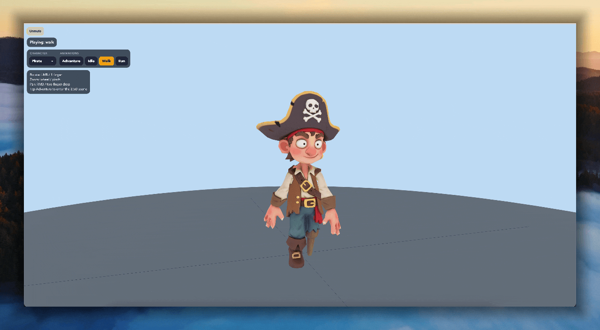

 

# Pirate 3D — Three.js + Capacitor for Desktop & iOS

This repo is the companion project for the YouTube build:
**"How to Vibe Code 3D iOS Apps with Claude Code"** ([watch on YouTube](https://www.youtube.com/watch?v=fu7NZ3t3sLM))

It includes:
- An interactive 3D character viewer built with **Three.js r150+** and **Vite** — animated GLB models with orbit camera controls.
- 2 characters (Pirate & Bartender) with idle, walk, run, and talk animations driven by a JSON animation index.
- Touch controls (single-finger rotate, two-finger zoom/pan) for iOS deployment via **Capacitor**.
- The **Agent Skills** used in the video (Claude Code for Three.js scene building & Capacitor iOS builds).

## Want more?

If you want the all-in-one workflow kit I use across **Claude Code, Codex CLI, and Cursor**—including ready-to-run agents/skills/rules and full source from my YouTube builds—check out [BuilderPack.ai](https://www.builderpack.ai/?utm_campaign=threejs_pirate_01&utm_source=github&utm_medium=readme).

---

## Running the App

Requires [Node.js 18+](https://nodejs.org/) installed.

```bash
npm install
npm run dev
```

### iOS (requires macOS + Xcode)

```bash
npm run build
npx cap sync ios
npx cap run ios
```

No external sprites or textures — characters are self-contained GLB models.

## Project Structure

```
index.html                # Entry point
src/
  main.js                 # Three.js scene, renderer, animation loop
public/
  assets/
    assets_index.json     # Animation metadata (clip names, durations, loop modes)
    glb/
      pirate/
        pirate_skeleton.glb
        pirate_animations.glb
      bartender/
        bartender_skeleton.glb
        bartender_animations.glb
prompts/
  01-character-creation.txt   # Gemini 3D character generation
  02-level-creation.txt       # 2.5D background creation
  03-character-voice.txt      # Voice persona definitions
  04-animate-bg.txt           # Looping background animations
  05-asset-json.txt           # Animation index metadata
  06-threejs-scene.txt        # Three.js viewer scene setup
```

## License

MIT
